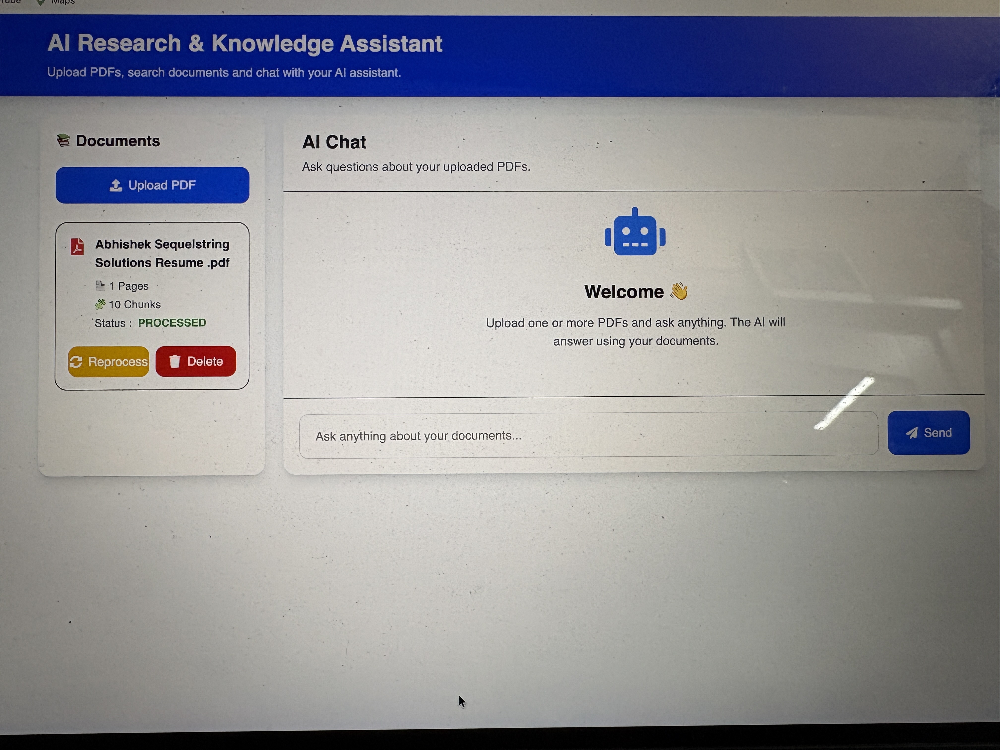
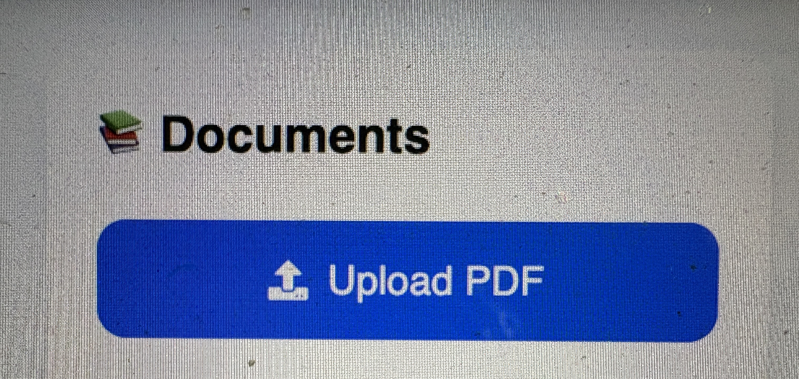
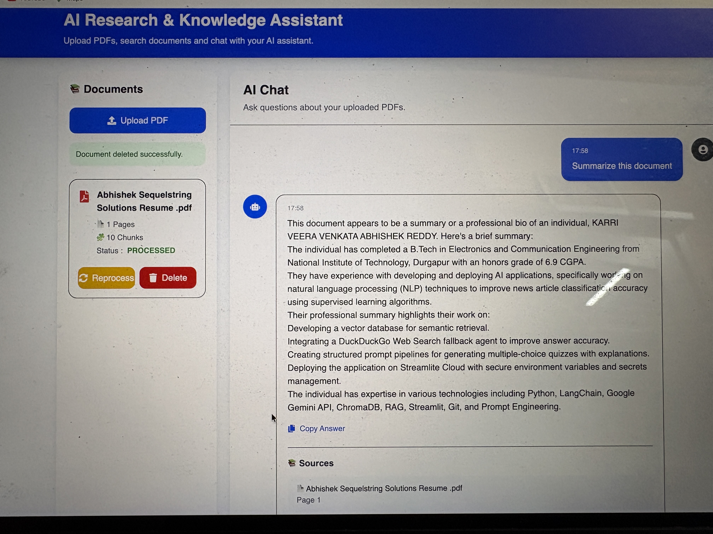

# 🤖 AI Research & Knowledge Assistant

An intelligent Retrieval-Augmented Generation (RAG) application that allows users to upload PDF documents, search them semantically, and ask natural language questions. The assistant retrieves the most relevant document chunks and generates context-aware answers using AI.

---

# ✨ Features

- 📄 Upload PDF documents
- 🧠 AI-powered Question Answering (RAG)
- 🔍 Semantic Search using Vector Embeddings
- 📚 Source Citation Support
- ♻️ Reprocess Documents
- 🗑 Delete Documents
- 💬 Chat-style Interface
- ⚡ FastAPI Backend
- ⚛️ React + TypeScript Frontend

---

# 🛠 Tech Stack

## Frontend

- React
- TypeScript
- Vite
- Tailwind CSS
- Axios
- React Markdown

## Backend

- FastAPI
- Python
- SQLAlchemy
- ChromaDB
- Sentence Transformers
- PyMuPDF

## AI

- Retrieval Augmented Generation (RAG)
- Embedding-based Semantic Search

---

# 📂 Project Structure

```text
AI-Research-Knowledge-Assistant
│
├── app/
├── frontend/
├── data/
├── models/
├── tests/
├── screenshots/
├── main.py
├── requirements.txt
└── README.md
```

---

# ⚙️ Installation

## Clone Repository

```bash
git clone <your-github-repository>
cd AI-Research-Knowledge-Assistant
```

## Backend

```bash
pip install -r requirements.txt
python main.py
```

## Frontend

```bash
cd frontend
npm install
npm run dev
```

---

# 🚀 Features Demonstration

- Upload PDF documents
- Automatic text extraction
- Document chunking
- Embedding generation
- Semantic retrieval
- AI-powered responses
- Source citations
- Document management

---

# 📸 Screenshots

## Dashboard



---

## Upload PDF



---

## Documents


---

## AI Chat



---

## Sources


---

# 🔮 Future Improvements

- Multi-user authentication
- Cloud database support
- Drag & Drop PDF upload
- Multiple LLM provider support
- OCR support for scanned PDFs
- Conversation history
- Docker deployment

---

# 👨‍💻 Author

**Karri Veera Venkata Abhishek Reddy**

B.Tech Electronics & Communication Engineering

National Institute of Technology Durgapur

GitHub: *(Add your GitHub profile link here)*

LinkedIn: *(Add your LinkedIn profile link here)*